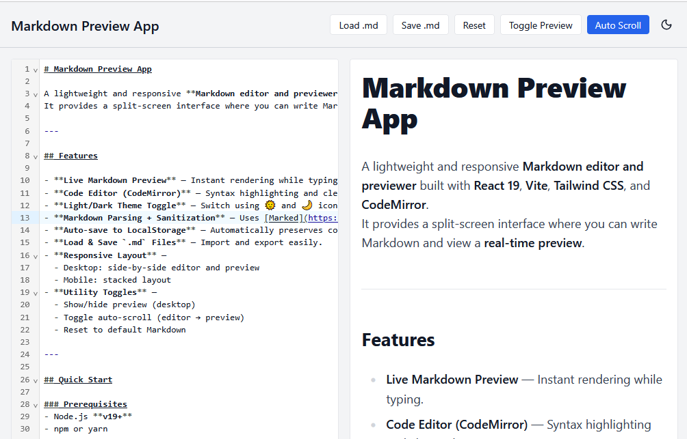
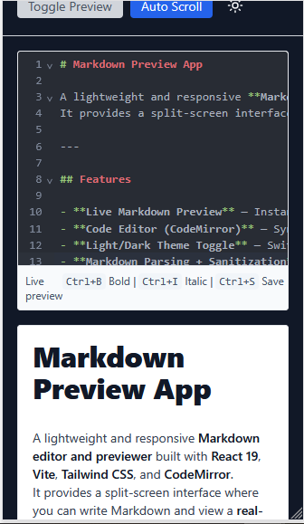
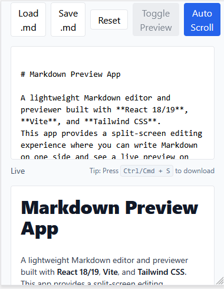

 

# Markdown Preview App

A lightweight and responsive **Markdown editor and previewer** built with **Vue 3**, **Vite**, **Tailwind CSS**, and **CodeMirror**.
It provides a split-screen interface where you can write Markdown and view a **real-time preview**.

---

## Features

* **Live Markdown Preview** — Instant rendering while typing.
* **Code Editor (CodeMirror)** — Syntax highlighting and clean editing experience.
* **Light/Dark Theme Toggle** — Switch using 🌞 and 🌙 icons.
* **Markdown Parsing + Sanitization** — Uses [Marked](https://github.com/markedjs/marked) and [DOMPurify](https://github.com/cure53/DOMPurify).
* **Auto-save to LocalStorage** — Automatically preserves content.
* **Load & Save `.md` Files** — Import and export easily.
* **Responsive Layout** —

  * Desktop: side-by-side editor and preview
  * Mobile: stacked layout
* **Utility Toggles** —

  * Show/hide preview (desktop)
  * Toggle auto-scroll (editor → preview)
  * Reset to default Markdown

---

## Quick Start

### Prerequisites

* Node.js **v19+**
* npm or yarn

### Installation

```bash
git clone https://github.com/Kinyua1299/Markdown-Preview-App-Vue-
cd markdown-preview-app
npm install
```

### Development

```bash
npm run dev
```

Then open [http://localhost:5173/](http://localhost:5173/)

### Production

```bash
npm run build
npm run preview
```
---
### Online deployed using Vercel
Use this link: [https://markdown-preview-app-vue.vercel.app/](https://markdown-preview-app-vue.vercel.app/)
---

## Project Structure

```plaintext
Markdown Preview App
├── .gitignore
├── index.html
├── package.json
├── pnpm-lock.yaml
├── postcss.config.cjs
├── public
│   ├── Desktop-preview-Dark.PNG
│   ├── Desktop-preview-Light.PNG
│   ├── Mobile-preview-Dark.PNG
│   └── Mobile-preview-Light.PNG
├── README.md
├── src
│   ├── App.vue
│   ├── assets
│   ├── components
│   │   └── ErrorBoundary.vue
│   ├── index.css
│   ├── main.ts
│   ├── router
│   │   └── index.ts
│   ├── __tests__
│   │   └── EditorPage.test.ts
│   └── views
│       ├── EditorPage.vue
│       ├── ErrorTest.vue
│       ├── Home.vue
│       └── NotFound.vue
├── tailwind.config.mjs
└── vite.config.js


```

---

## Scripts

| Command           | Description                         |
| ----------------- | ----------------------------------- |
| `npm run dev`     | Start development server            |
| `npm run build`   | Build for production                |
| `npm run preview` | Preview production build            |
| `npm test`        | Run tests (Vitest + Vue Test Utils) |

---

## Tech Stack

* **Vue 3 + TypeScript**
* **Vite**
* **Tailwind CSS**
* **CodeMirror 6**
* **Marked**
* **DOMPurify**
* **Lucide Vue Next** (icons)
* **Vitest** + **Vue Test Utils**

---

## Screenshots

### Desktop

| Dark Theme                                 | Light Theme                                  |
| ------------------------------------------ | -------------------------------------------- |
|  |  |

### Mobile

| Dark Theme                               | Light Theme                                |
| ---------------------------------------- | ------------------------------------------ |
|  |  |

---

## Known Issues

* Basic Markdown support (no plugins)
* Auto-scroll works one-way (Editor → Preview)
* No backend integration
* Minor flicker on theme toggle in some browsers

---

## Future Improvements

* Full dark mode across all UI
* Two-way scroll synchronization
* Export as PDF
* Cloud sync (GitHub Gist, Firebase)
* Collaborative real-time editing

---

## License

MIT License © 2026 **King**

---
  
